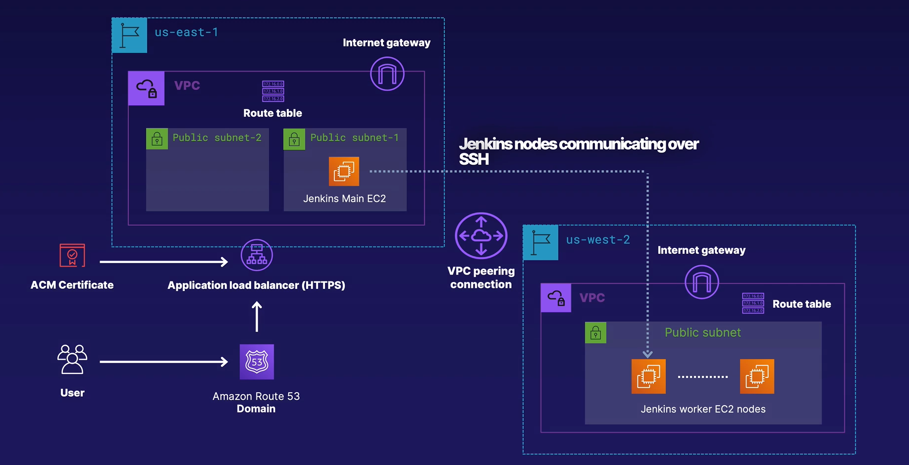

# Terraform_IaC_Ansible
## Lab situation:
- Create 2 VPCs in 2 different regions, VPC-1 has 2 public subnets, VPC-2 has 1 subnet.
- Have VPC peering
- Jenkins master is located at VPC-1 subnet01
- Jenkins worker is located in VPC-2
- Jenkins nodes communicate with each other via SSH
- User accesses domain with SSL via route 53 to enter jenkins master.
- Terraform will save state file in S3

## Pre-run
- Make sure create user programatic IAM `terraform` with permission is `./depend/terraform_deployment_lax_iam_policy.json`
- Make sure localhost install: aws-cli, terraform, ansible
- Configure aws with profile is terraform: `aws configure --profile terraform`
- Create S3 bucket name: `aws s3api create-bucket --bucket terraformstate1994 --profile terraform` 
- install boto3 using pip3: `pip3 install boto3 --user`
- noted: with plugin aws_ec2 in ansible, you need follow option `boto_profile: <aws_profile>` if using aws configure --profile affter
- when run ansible playbook, make sure private key id_rsa located at ~/.ssh/id_rsa
- Determine domain in route53: `aws route53 list-hosted-zones --profile terraform`, edit domain at variables.tf